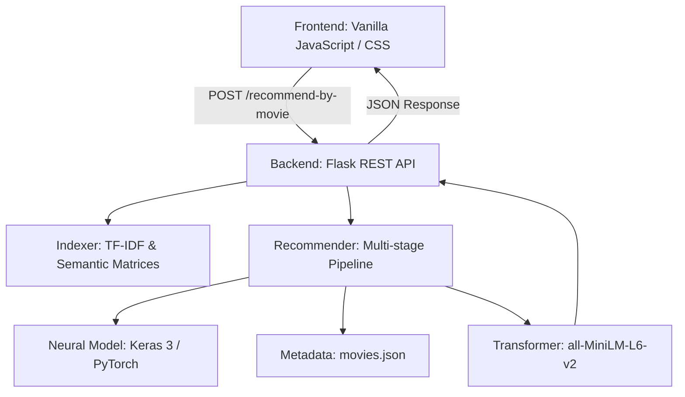

# MovieMind: System Architecture and Infrastructure

## 1. Executive Summary
MovieMind is a Hybrid Intelligent Recommendation Engine developed to move beyond surface-level keyword matching. It utilizes a multi-layered architecture that integrates Deep Learning Transformers, Statistical Information Retrieval (TF-IDF), and Neural Collaborative Filtering (Keras) to deliver high-precision cinematic suggestions.

---

## 2. System Architecture
The application is built on a distributed Client-Server-Model architecture, optimized for high-performance inference and low-latency response times.

### Technical Components:
- **Frontend Layer**: A lightweight interface built with standard web technologies. It manages user state (interaction history) and performs title normalization for search routing.
- **Backend Service (Flask)**: The central orchestration layer. It manages the recommendation execution loop and maintains the primary search index in memory for O(1) attribute access.
- **Neural Layer (Keras 3)**: A secondary ranking layer that utilizes a neural collaborative filtering model. To ensure compatibility with modern environments (including Python 3.14), this layer operates using the PyTorch backend.

---

## 3. Data Engineering Pipeline
The system's thematic intelligence is generated through a rigorous asynchronous pipeline:

### Phase 1: Ingestion and Cleaning
- Source: TMDB 5000 dataset.
- Normalization: Titles are standardized and release years are extracted for display and search robustness.

### Phase 2: Thematic Clustering
The system employs a proprietary "Thematic Bank" to categorize metadata:
- **Filtering**: Removal of generic or low-information keywords.
- **Clustering**: Grouping of related concepts into high-value thematic clusters (e.g., categorizing "cyberpunk" and "neon" into the DYSTOPIA cluster).

### Phase 3: Semantic Vectorization
Metadata sets are flattened into thematic documents and encoded into 384-dimensional vectors using the Sentence-BERT (all-MiniLM-L6-v2) framework.

---

## 4. The Recommendation Execution Loop
Upon receiving a request, the engine executes a standardized 5-stage pipeline:

### Stage 1: Retrieval (Candidate Generation)
Initial candidates are selected based on raw content similarity using a hybrid TF-IDF and Semantic Cosine Similarity approach.

### Stage 2: Structural Filtering
Strict heuristic gates eliminate irrelevant results based on thematic cluster incongruity or tone incompatibility (e.g., blocking disparate genre transitions).

### Stage 3: Hybrid Scoring
Dynamic scoring based on Semantic Similarity (45%), IMDb Weighted Ratings (15%), and thematic overlap bonuses.

### Stage 4: Neural Re-Ranking
The top candidates are processed by the Keras model to generate a Neural Score adjusted for collaborative filtering signals.

### Stage 5: Diversity Maintenance (MMR)
The Maximal Marginal Relevance algorithm is applied to prune redundant results and ensure a diverse set of final recommendations.

---

## 5. Technical Specifications
- **Indexing Pool**: 4,797 movies (TMDB 5k).
- **RAM Requirements**: Approximately 150-200MB during inference.
- **Inference Speed**: ~4.5ms per request (CPU-bound).
- **Compatibility**: Python 3.14+; Keras 3 with Torch Backend.

---

This documentation outlines the core infrastructure of the MovieMind engine as of the current production version.
