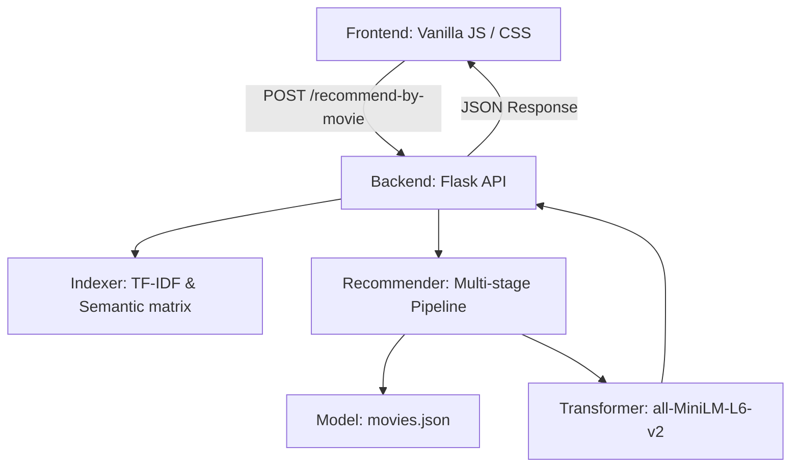

# MovieMind: System Deep Dive & Architecture

## 1. Executive Summary
MovieMind is a **Hybrid Intelligent Recommendation Engine** that moves beyond simple keyword matching to understand cinematic concepts, thematic clusters, and director styles. It uses a multi-layered approach combining **Deep Learning (Transformers)**, **Statistical Retrieval (TF-IDF)**, and **Heuristic Filtering**.

---

## 2. System Architecture
The system follows a classic **Client-Server-Model** architecture:

### Components:
- **Frontend**: A high-performance, dark-themed UI built with Vanilla HTML/CSS/JS. It handles the user-input normalization and state management for "Liked" and "Seen" movies.
- **Backend (Flask)**: Orchestrates the recommendation loop. It is stateful only during the recommendation request, maintaining the movie index in RAM for O(1) attribute lookups.
- **Model Layer**: Consists of a pre-computed `movies.json` containing metadata and 384-dimensional semantic embeddings.

---

## 3. Data Engineering Pipeline
The "Brain" is built using `build_tmdb_metadata.py`.

### Step 1: Ingestion
- Fetches the **TMDB 5000** dataset.
- Filters and cleans movie titles and release years.

### Step 2: High-Value Theme Extraction
Instead of trusting all keywords, the system uses a **Thematic Bank** to cluster keywords into "High-Value" concepts:
- **Blacklist**: Filters out generic noise (e.g., "woman director", "frog", "city").
- **Clustering**: Groups "ghost", "haunted house", and "poltergeist" into the **PARANORMAL** cluster.

### Step 3: Semantic Vectorization
Each movie's metadata (Themes + Keywords + Plot + Personnel) is flattened into a "Thematic Document" and encoded into a vector using the **Sentence-BERT (all-MiniLM-L6-v2)** model.

---

## 4. The Recommendation Pipeline
When a request is received, the system executes a 5-step pipeline:

### Stage 1: Candidate Generation
Finds the top 500 potential matches based on Raw Semantic Similarity (Cosine distance).

### Stage 2: Hard Filtering (The Gatekeeper)
Applies strict rules to eliminate irrelevant results:
- **Cluster Enforcement**: If the source movie is in a High-Value Cluster (e.g., Space), and the target is not, the target is discarded (unless semantic similarity is >0.85).
- **Incompatibility Filter**: Discards Horror suggestions if the user is looking at a Family movie.

### Stage 3: Hybrid Scoring
Calculates a final score based on:
- **Semantic Score (45%)**
- **IMDb Weighted Rating (15%)**
- **Thematic Bonus (up to +0.4)**: Intense boost if 2+ high-value clusters match.
- **Noise Penalty (-0.3)**: Penalizes "shallow" matches that share only generic genres.

### Stage 4: Diversity Re-Ranking (MMR)
Uses **Maximal Marginal Relevance** to ensure the top 10 results aren't just sequels. It balances "How similar is this to the search?" vs "How different is this from the movies already chosen?".

### Stage 5: Sort & Explain
- Final sort by `predicted_rating`.
- **Reason Generation**: Moves through a priority hierarchy (Cluster -> Concept -> Personnel -> Keywords) to explain *why* it matched.

---

## 5. UI/UX Design Philosophy
MovieMind uses a **"Cinema Dark"** aesthetic:
- **Accent Color**: Deep Purple (`#8b5cf6`) and Lavender (`#c4b5fd`).
- **Surface Design**: Uses semi-transparent glassmorphism for tags and buttons.
- **Animation**: Micro-transitions on hover and loading states to ensure the app feels "alive."

---

## 6. Maintenance and Scaling
- **Index Size**: 4797 movies.
- **RAM Footprint**: ~150MB (mostly for SentenceTransformer and the TF-IDF matrix).
- **Indexing Speed**: ~3.2ms per recommendation request on a modern CPU.
- **Updating**: To add new movies, simply run `python backend/build_tmdb_metadata.py`.

---

> [!NOTE]
> This system is designed for high precision. It prefers returning 5 perfect matches over 50 "okay" matches.
